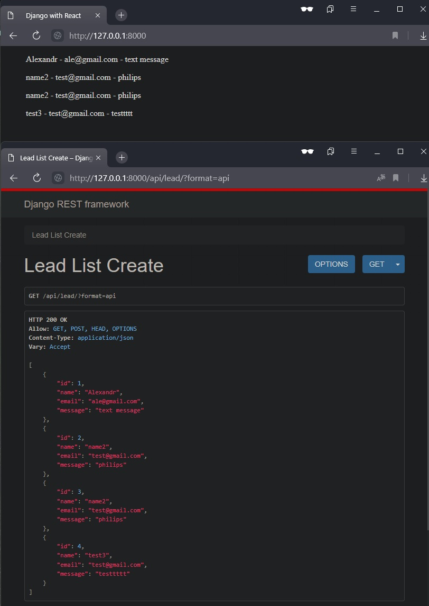

# Django REST framework + React.js

npm i webpack webpack-cli --save-dev
 
npm i @babel/core babel-loader @babel/preset-env @babel/preset-react --save-dev
 
npm i react react-dom --save-dev
  
npm run dev
 
python manage.py runserver

